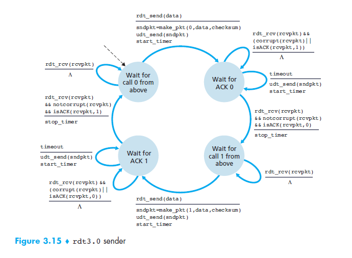
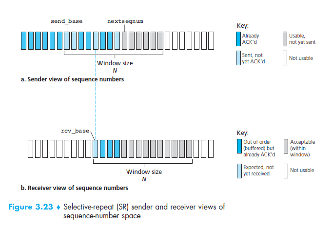



# Reliable Data Transfer Protocols

## Stop and Wait Protocols

A simplified reliable data transfer protocol outlined in the book *Computer
Networking: A Top-Down Approach* by James Kurose and Keith Ross is a good
example of a **stop and wait protocol**. They refer to the protocol simply as
`rdt3.0`. Here is an image of the FSM for the sender routine.

The protocol involves the use of checksums, sequence numbers, a timer, as well
as the use of both positive and negative acknowledgments. If a checksum is 
calculated differently at the receiver than it was recorded as at the sender, 
then a negative acknowledgment is returned. If the checksum matches then a
positive acknowledgment is returned. If the packet does not arrive at all then
no acknowledgment will be returned and the timer at the sender will timeout and
the lost packet will be retransmitted. If an acknowledgment is lost then the
timeout will also occur causing retransmission. The following image from the
Kurose Ross book shows the four main scenarios illustrated by the following
timing diagrams

Only two different sequence numbers are used, 0 and 1, which are alternated
between for each sucessful packet delivery. If you examine the above diagrams
you will see why the sequence numbers are needed to keep up with which packet
is which when a premature timeout expires but neither the packet nor the ACK
has been lost. This introduces duplicate data packets in which case only the
sequence numbers allow the protocol to handle correctly. Because of the
alternating sequence numbers this type of protocol is also often referred to as 
an **alternating-bit protocol**.

This protocol is called a *stop and wait* protocol because it only tries to have
one outstanding packet in the sender-receiver channel at any given time. In
other words, it only sends the next packet after it is sure the current packet
has been received correctly (through the indication of a postive
acknowledgment).

## Pipelined Protocols

The protocol `rdt3.0` described in the Kurose Ross book is *functionally
correct* meaning that it can be shown that it will deliver packets correctly and
in order in ALL situations. However, the performance of `rdt3.0` will be rather
poor due to the nature of stop and wait protocols. The fact that only one packet
is being sent at a time means that we will have utterly low link utilization.

### Example of Performance of Stop and Wait Protocol

Consider two hosts situated rather geographically distant so that the
propogation delay between them will be relatively large. For a propogation delay
assumed to be at the speed of light, lets assume a propogation delay from one
end to the other will be `P = 20 ms`. Suppose they are connected on a high
speed gigabit channel with tansmission rate of
`R = 1 Gbps = 10^9 bits per second`, and sending packets of size
`L = 2KB = 2,000 bytes`. Since we have approximately `16,000 bits` per
 packet (headers and data), then the transmission delay can then be calculated
as

	d_t = L / R = 16,000 b / 10^9 bps = 16 usec = 16 * 10^(-6) sec

If the sender begins transmission at `t_0 = 0`, then the last bit would enter
the channel at the sender side at `t_1 = L / R = 16 usec`. The packet would
travel at the speed of light, the first bit arriving at `t_2 = P = 20 ms` and
the last bit arriving at 

	t_3 = P + (L / R) = 20 ms + 16 usec = 20.016 ms

It will take the same amount of time for the receiver to send an acknowledgment
to the sender. If we ignore the transmission delay for the very small ACK packet
then it would arrive back at the sender at 

	t_4 = 2 * P + L / R = 40.016 ms

Only after this point in time, `t_4` can the sender transmit another packet.
This means that the sender only has a link utilizatization of

    U = (L / R) / (2 * P + L / R)
      = (16 * 10^(-6)) sec / (40.016 * 10^(-3)) sec = 0.0004

In other words our stop and wait protocol was only able to acheive a link
utilization of 0.04% in this case! This is not good. In order to solve this
problem with stop and wait protocols, we use a technique known as 
**pipelining**. This technique is not only used in networking, but also heavily
relied on in computer architecture as well and is employed by most modern
processors.

Using pipelining in a reliable data transfer protocol will have some known
consequences as well:

 * The number of sequence numbers used will have to be increased to accomodate
   the number of packets that can be oustanding in the sender-receiver channel
   at a given time.
 
 * The sender will have to buffer all the packets that have been transmitted
   but for which an acknowledgment has not yet been received. Buffering at the
   receiver may also be needed.

There are two approaches that are generally used in pipelining protocols to deal
with error recovery.

### Go-Back-N (GBN) Protocols

 * Sender is able to transmit multiple packets if available and without waiting
   for acknowledgments.
 * Sender cannot have anymore than some maximum allowable number, `N`, of
   outstanding currently unacknowledged packets in the channel.

Kurose in ross are able to define four different intervals in the range of
sequence numbers used in a GBN protocol. If we define the sequence number of the
oldest unacknowledged packet as `base`, and the smallest unused sequence number
as `nextseqnum`, which is also the sequence number of the next packet to be
sent. Then the four intervals are defined as follows:

 * The interval `[0, base - 1]` covers sequence numbers that have been
   transmitted and acknowledged.
 * The interval `[base, nextseqnum -1]` consists of sequence numbers of packets
   that have already been transmitted but are as of yet unacknowledged. 
 * The interval  `[nextseqnum, base + N-1]` consists of packets which can be
   sent immediately if data arrives from the upper application layer.
 * The interval covering sequence numbers greater than or equal to `base+N`
   cannot be used until an unacknowledged packet, is acknowledged.

When an a given acknowledgment is received at the sender from the receiver, the
Go-Back-N protocol may allow the sender to automatically acknowledge any
unacknowledged packets with a sequence number less than the sequence number
being acknowledged, even if no acknowledgment has actually been received for
these packets. This is possible due to the fact that the sender knows that the
GBN receiver will only ACK a packet if it has received all other packets with
sequence numbers less than the received packet.

The range of sequence numbers that may be oustanding in the channel is usually
thought of as a window of size N of packets that may be sent. The window slides
as more packets are acknowledged. Because of this, the Go-Back-N and other
protocols that operate similarly, are often also referred to as 
**sliding-window protocols**.

One might wonder why we limit the number of outstanding packets at all if this
type of protocol will work. You may even reason that there is no need for such
a limit. However, you'd be wrong. Flow control is one, but not the only, reason
for this. Flow control is needed in order to ensure that the sender does not
overwhelm the receiver. If we have a sender that is capable of sending at a
much higher rate than the receiver is capable of receiving then we will have
many dropped packets and utilization will suffer.

A packets sequence number is carried in a fixed-length field in the packet
header. Because we are using a fixed-length sequence number field we must have
a finite range of valid sequence numbers. If the number of bits used in the
sequence header is `n` then the range of valid sequence numbers will be
 `[0, 2^n - 1]`. The **sequence number space** may, therefore, be though of
as a ring of size `2^n`. The common reliable data transfer protocol in use
today, TCP, uses 32-bit sequence numbers. TCP sequence numbers also refer to
bytes in the stream rather than packets.

The following FSM diagrams from the Kurose Ross text illustrate the sender and
receiver sides of the GBN protocol.

It's easy to think you understand how this protocol will work, but almost no one
quite understands how it is going to work in every situation just by reading a
description like I have provided. What I would recommend is checking out this
open source java applet which simulates and visualizes a Go-Back-N protocol.
You should go play with the [**Go-Back-N applet**][1], first seeing how it works
under normal conditions and then try killing some packets on the way to the
receiver. Also try killing some acknowledgments on the way to the sender to see
how it will work in all situations.

The name **Go-Back-N** is derived from the fact that when a timeout occurs on
an unacknowledged packet, then the sender retransmits all of the currently
unacknolwedged packets. The protocol only maintains a single timer for the
oldest unacknowledged packet. If there are still additional outstanding
unacknowledged packets in the channel when the acknowledgment for the oldest
packet arrives, the timer is simply restarted for the next oldest packet.

### Selective Repeat (SR) Protocols

The GBN protocol allows the pipeline between the receiver-sender to be
relatively fully utilized. Hwoever, there are sscenarios in which the protocol's
perfromance will suffer. If the window size and what's called the 
[**bandwidth-delay product**][2] product are both large then there will be many
oustanding unacknowledged packets at any given time. In this situation a single
packet error can cause the GBN protocol to retransmit many packets. If this
happens often, then the many unnecessary retransmissions will fill the pipeline
often and performance will suffer because of it.

**Selective repeat protocols** attempt to avoid unneccessary retransmissions by
only retransmitting those packets that appear to have been lost or corrupted.
This is acheived by having the receiver *individually*, rather than
*cumulatively*, acknowledge correctly received packets. Again a window size of
`N` will be used to limit the number of currently oustanding packets in the
channel. However, unlike the GBN protocol, the SR sender will already have
received acknowledgements for some of the packets in the window and will keep
a timer for each unacknowledged packet. The following diagram illustrates the 
view of the sequence number space and the window from the point of view of both
the sender and receiver.

The SR protocol receiver acknowledges correctly received packets regardless
of whether they are out of order. Because of this the receiver must buffer out
of order packets until any missing packets (with lower sequence numbers) arrive.
At the point when the missing packets arrive, a batch of packets can then be
delivered to the upper application layer.

Note that, unlike the GBN receiver, the SR receiver cannot ignore incoming
retransmitted packets which have already been received (due to a lost or
corrupted acknowledgment). This is necessary because if an acknowledgment is
lost, the sender will eventually have to retransmit that packet before the
window will advance beyond it. If the receiver ignores this retransmission then
the sender's window would never advance any further. As a consequence, the
sender and receiver will not always have an identical view of what has been
received correctly. This also means that the sliding window for the sender and
receiver will can be at different positions.

There are three events that an SR sender must act upon listed as follows:

 1. **Data received from application layer.**
   - The sender determines the next available sequence number for the new
     packet to be created. If the sequence number is within the sliding window,
     then the packet is created and transmitted. If the next sequence number is
     beyond the sliding window's current position, then the sender will have to
     buffer the data or return it to the upper layer.
 2. **Timeout waiting for an acknowledgment.**
   - A timeout must be kept for each unacknowledged packet in the channel.
     Upon a timeout expiring, the packet for which the timeout occured is
     retransmitted.
 3. **Acknowledgment for a packet is received.**
   - Sender marks the packet as correctly received if it is in the window. If
     and only if the acknowledgment sequence number is equal to `send_base`
     (the first sequence number in the window), then the window is moved
     forward to begin at the next sequence number that has of yet has not been
     acknowledged.

There are also several events for which an SR receive must act upon:

 1. **Sequence number `rcv_base` correctly received.**
   - `rcv_base` is packet with the samllest sequence number that has of yet to
     be received. The receivers window slides forward to begin at the next as of
     yet received packet, and all packets before this are delivered to the upper
     application layer.
 2. **Sequence number within `[rcv_base + 1, rcv_base + N-1]` correctly
    received.**
   - The packet falls within the receiver's sliding window, however, there is
     still at least 1 other packet, `rcv_base`, which has not been correctly
     received. This packet must be buffered before it can be delivered to the
     application layer. It will only be delivered once all other outstanding
     packets with sequence numbers less than it have been received.
 3. **Sequence number within `[rcv_base - N, rcv_base - 1]` correctly
    received.**
   - This is a packet that the receiver has already previously acknowledged.
     This happens due to either a premature timeout, or a lost acknowledgment.
     In this case, another acknowledgment must be generated in order to ensure
     that the sender's window advances.

There is an applet, similar to the [**Go-Back-N Applet**][1], which demonstrates
the selective repeat protocol. You are encouraged to check out the
[**Selective Repeat Applet**][3] and compare the two protocols.

### Getting Rid Of Another Assumption

An assumption that we made in describing all three of the previous protocols is
that the underlying unreliable channel will not reorder packets. When reordering
can occur at the lower layers, then the effect is that a sequence numbers may
arrive that are in neither the sender nor the receivers current window. The
solution to this problem is to ensure that sequence numbers are not reused until
the sender is certain that the a packet with the given sequence number could not
possibly be somewhere in the network. This is implemented in practice by having
a maximum packet lifetime that a packet can live in the network. This is known
through the use of the `TTL` field in the IP datagram header utilized in the
network below the reliable data tranfer protocol. TCP assumes a maximum packet
lifetime of approximately 3 minutes as defined in RFC 1323.

## Connection-Oriented Protocols

TCP, the Web's transport-layer, does in fact rely on many of the principles and
approaches outlined above in the previous classifications of protocols. These
include error detection, retransmitted lost/corrupted packets, cumulative
acknowledgments, packet timers, and sequence numbers. However, TCP also employs
a technique known as **connection-oriented transport**. This means that in order
for two processes to communicate using the protocol, they must first establish
a connection. This is accomplished through what is known as a **handshake**
consisting of sending setup packets sent in order to estbalish the data
transfer on both the sending and receiving ends.

A transport-layer protocol that sets up a connection in a manner similar to TCP
does not have a connection in the physical sense between sender and receiver
such as is the case in circuit-switched networks. The intermediate network
components (routers) do not maintain the connection state, and it is setup,
torn down, and maintained completely at the end systems. Routers are completely
oblivious to upper-layer protocols.

A TCP connection can provide a **full-duplex channel** meaning that data can be
sent in both directions between two processes simultaneously. A TCP connection
is also always **point-to-point** meaning that there are only two end points
between which the connection exists. A technique known as **multicasting**, in
which data is transferred from one process to many simultaneously, is not
possible with TCP due to the point-to-point nature of its connections.

[1]: http://media.pearsoncmg.com/aw/aw_kurose_network_2/applets/go-back-n/go-back-n.html
[2]: http://en.wikipedia.org/wiki/Bandwidth-delay_product
[3]: http://www.eecis.udel.edu/~amer/450/TransportApplets/SR/SRindex.html